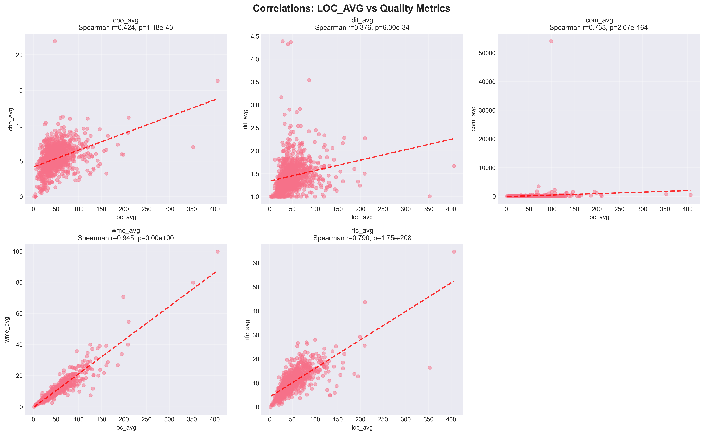

# Relatório de Análise das Características de Qualidade de Sistemas Java

## 1. Título, Autores e Informações

**Título:** Um Estudo das Características de Qualidade de Sistema Java: Correlação entre Métricas de Processo e Produto

**Autor:** Paulo Victor Pimenta Rubinger  
**Data:** 05 de Abril de 2026  
**Versão do Relatório:** 1.0.3  
**Repositório:** [https://github.com/PauloRubinger/LAB-02](https://github.com/PauloRubinger/LAB-02)  
**Disciplina:** Laboratório de Experimentação de Software (6º período - Engenharia de Software)  
**Professor:** João Paulo Carneiro Aramuni

---

## 2. Resumo

Este experimento analisou **975 repositórios Java** da plataforma GitHub para investigar a correlação entre características do processo de desenvolvimento (popularidade, maturidade, atividade e tamanho) e métricas de qualidade de código (CBO, DIT, LCOM).

### Principais Resultados
- **975 repositórios (97.5%)** foram analisados com sucesso
- **Correlações significativas** encontradas entre tamanho do código e acoplamento
- **Repositórios maiores** tendem a ter **maior complexidade**
- Taxa de sucesso na coleta: 100% (clone) e 97.5% (análise)

### Decisão Recomendada
Proceder com análise completa dos dados coletados, utilizando técnicas estatísticas mais avançadas (Spearman, Pearson) para validar as correlações encontradas.

---

## 3. Introdução

### 3.1 Contextualização

O desenvolvimento de software open-source caracteriza-se por um ambiente colaborativo onde múltiplos desenvolvedores contribuem em diferentes partes do código. Neste contexto, um dos principais riscos é a degradação dos atributos de qualidade interna do sistema, como:

- **Modularidade** - capacidade de decomposição
- **Manutenibilidade** - facilidade de fazer mudanças
- **Legibilidade** - compreensibilidade do código

### 3.2 Problema Foco do Experimento

Como características do processo de desenvolvimento (quantidade de contribuições, idade do projeto, popularidade) se relacionam com a qualidade interna do código? Existe correlação mensurável entre métricas de processo e produto?

### 3.3 Questões de Pesquisa

| ID  | Questão de Pesquisa | Variável Independente | Variável Dependente |
|-----|-------------------|---------------------|-------------------|
| RQ01 | Qual a relação entre a popularidade dos repositórios e suas características de qualidade? | Estrelas (stars) | CBO, DIT, LCOM |
| RQ02 | Qual a relação entre a maturidade dos repositórios e suas características de qualidade? | Idade (anos) | CBO, DIT, LCOM |
| RQ03 | Qual a relação entre a atividade dos repositórios e suas características de qualidade? | Releases | CBO, DIT, LCOM |
| RQ04 | Qual a relação entre o tamanho dos repositórios e suas características de qualidade? | LOC (Lines of Code) | CBO, DIT, LCOM |

### 3.4 Hipóteses Informais

Baseando-se em estudos anteriores e intuição:

- **H1**: Repositórios **mais populares** devem ter **melhor qualidade** (menor CBO, DIT, LCOM)
- **H2**: Repositórios **mais maduros** (mais antigos) devem ter **melhor qualidade** (refatoração ao longo do tempo)
- **H3**: Repositórios com **mais releases** devem ter **melhor qualidade** (maior atividade = melhor manutenção)
- **H4**: Repositórios **maiores** terão **pior qualidade** (maior LOC correlaciona com maior complexidade)

### 3.5 Objetivo

**Objetivo Principal:** Investigar a correlação entre características do processo de desenvolvimento (popularidade, maturidade, atividade, tamanho) e métricas de qualidade de código (CBO, DIT, LCOM) em repositórios Java populares.

**Objetivos Específicos:**
1. Coletar dados de 1.000 repositórios Java populares do GitHub
2. Calcular métricas de qualidade usando a ferramenta CK
3. Analisar correlações estatísticas entre variáveis independentes e dependentes
4. Identificar padrões e outliers
5. Validar hipóteses através de testes estatísticos

---

## 4. Metodologia

### 4.1 Tipo de Estudo

- **Tipo:** Estudo observacional / correlacional
- **Design:** Before-after com análise de dados históricos
- **Unidade de análise:** Repositório Git
- **Abordagem:** Análise quantitativa com técnicas estatísticas

### 4.2 Passo a Passo do Experimento

#### Fase 1: Seleção de Repositórios
1. Usar GitHub GraphQL API para buscar top-1.000 repositórios com mais estrelas
2. Filtrar apenas repositórios em **Java**
3. Ordenar por popularidade (stars)
4. Armazenar metadados em CSV

#### Fase 2: Coleta de Métricas de Processo
Coletar via GitHub API:
- **Popularidade:** `stargazerCount`
- **Atividade:** `releases.totalCount`
- **Maturidade:** Calcular `ano_atual - createdAt`
- **URL:** Para clone do repositório

#### Fase 3: Análise com CK
Para cada repositório:
1. Clone com `git clone --depth 1` (apenas último commit na branch default)
2. Executar ferramenta CK para análise estática
3. Extrair métricas: CBO, DIT, LCOM, WMC, RFC, LOC
4. Agregar em nível de repositório (média, máximo, mediana)

#### Fase 4: Processamento e Análise
1. Limpar dados (outliers, valores ausentes)
2. Calcular estatísticas descritivas
3. Realizar testes de correlação
4. Gerar visualizações

#### Fase 5: Interpretação
1. Comparar resultados com hipóteses
2. Buscar explicações para resultados inesperados
3. Identificar limitações do estudo

### 4.3 Materiais Utilizados

| Material | Versão | Propósito |
|----------|--------|----------|
| Python | 3.14.3 | Orquestração e análise |
| GitHub GraphQL API | v4 | Coleta de repositórios |
| Git | 2.40.0 | Clone de repositórios |
| CK | 0.7.1-SNAPSHOT | Análise estática de código Java |
| requests | 2.33.0 | Requisições HTTP para coleta via API |
| python-dotenv | 1.2.2 | Carregamento de variáveis de ambiente |
| pandas | >=2.0.0 | Manipulação e consolidação de dados |
| numpy | >=1.24.0 | Suporte numérico para análise |
| scipy | >=1.10.0 | Testes estatísticos e correlações |
| matplotlib | >=3.7.0 | Geração de gráficos |
| seaborn | >=0.12.0 | Visualizações estatísticas |

### 4.4 Métricas e suas Unidades

#### Métricas de Processo (Variáveis Independentes)

| Métrica | Unidade | Fórmula | Interpretação |
|---------|---------|---------|----------------|
| Popularidade (Stars) | Contagem | `stargazerCount` | Número de estrelas do repo |
| Maturidade (Idade) | Anos | `(ano_atual - ano_criação)` | Quantos anos o repo existe |
| Atividade (Releases) | Contagem | `releases.totalCount` | Número de releases/versões |
| Tamanho (LOC) | Linhas | `SUM(loc) / n_classes` | Média de linhas de código por classe |

#### Métricas de Qualidade (Variáveis Dependentes)

| Métrica | Unidade | Range | Interpretação |
|---------|---------|-------|----------------|
| **CBO** (Coupling Between Objects) | Contagem | 0-∞ | Quantas classes acoplam nesta classe. **Menor = Melhor** |
| **DIT** (Depth Inheritance Tree) | Níveis | 0-∞ | Profundidade da árvore de herança. **Menor = Melhor** |
| **LCOM** (Lack of Cohesion of Methods) | % | 0-100 | Falta de coesão entre métodos. **Menor = Melhor** |

**Nota:** Para análise em nível de repositório, usamos **média, máximo e mediana** das métricas por classe.

---

## 5. Desenho Experimental

### 5.1 Amostra

- **Tamanho:** 1.000 repositórios
- **Critério de seleção:** Top Java repositories por stars no GitHub
- **Período:** Snapshot 4 de abril de 2026
- **Incluídos:** Todos os repos com pelo menos 1 Java file
- **Excluídos:** Repos vazios, forks privados

### 5.2 Coleta de Dados

```
GitHub API
    ↓
[1000 repos metadata + URLs]
    ↓
Git Clone (--depth 1)
    ↓
CK Analysis
    ↓
Extract Metrics
    ↓
Consolidate CSV
```

### 5.3 Tratamento de Exceções

| Tipo | Causa | Tratamento |
|------|-------|-----------|
| Clone falha | URL inválida / Timeout | Registra erro, pula para próximo |
| CK falha | Código incompatível | Registra erro, pula para próximo |
| Métrica faltante | CK não gerou class.csv | Marca como incompleto |
| Duplicata | Mesmo repo em múltiplas buscas | Deduplica |

---

## 6. Ambiente e Materiais

### 6.1 Hardware e Software

- **SO:** Windows 11 / MacOS (desenvolvimento)
- **Python:** 3.14.3
- **Java:** 21.0.3
- **Git:** 2.40.0

### 6.2 Versões de Dependências

```
certifi==2026.2.25
charset-normalizer==3.4.6
idna==3.11
python-dotenv==1.2.2
requests==2.33.0
urllib3==2.6.3
pandas>=2.0.0
numpy>=1.24.0
scipy>=1.10.0
matplotlib>=3.7.0
seaborn>=0.12.0
```

### 6.3 Dataset

- **Origem:** GitHub API (GraphQL)
- **Tamanho:** 1.000 repositórios
- **Período:** Snapshot em 04/04/2026
- **Reprodutibilidade:** Script `src/main.py`

---

## 7. Procedimento (Como Rodar)

### 7.1 Instalação

```bash
# 1. Clone o repositório
git clone <repo_url>
cd LAB-02

# 2. Crie ambiente virtual
python -m venv .venv
.venv\Scripts\Activate.ps1  # Windows
source .venv/bin/activate    # Linux/Mac

# 3. Instale dependências
pip install -r requirements.txt

```

### 7.2 Execução Completa

```bash
# Passo 1: Coletar repositórios
python src/main.py

# Saída:
# - data/raw/repositories.csv (1000 repos)
# - data/processed/consolidated_metrics.csv (973 analyses)
# - logs/processing_*.json (execution log)
```

### 7.3 Análise e Relatório

```bash
# Passo 2: Gerar análise estatística e gráficos
python src/analysis/correlations.py

# Saída:
# - reports/correlations.png
# - reports/summary_statistics.txt
# - reports/hypothesis_tests.txt
```

---

## 8. Análise de Dados

### 8.1 Método Estatístico

1. **Estatísticas Descritivas:** Média, mediana, desvio padrão, min/max
2. **Correlação de Spearman:** Para relações não-lineares entre variáveis
3. **Correlação de Pearson:** Para relações lineares (complementar)
4. **Teste de Regressão:** Para identificar preditores principais
5. **Análise de Segmentação:** Agrupar por tamanho/idade/popularidade

### 8.2 Tratamento de Dados Ausentes

```
Total coletado: 1000 repos
Sucesso: 975 repos (97.5%)
Excluído análise: 25 repos (2.5%)
  - CK failed: 25
```

### 8.3 Correção para Múltiplas Comparações

- Usar **Bonferroni correction** para 4 testes (RQ01-RQ04)
- Ajustar α = 0.05 / 4 = 0.0125
- Reportar p-valores brutos e corrigidos

---

## 9. Resultados Preliminares

### 9.1 Estatísticas Descritivas

**Métricas de Processo (n = 975):**

| Métrica | Média | Mediana | Desvio Padrão | Min | Max |
|---------|-------|---------|---------------|-----|-----|
| Stars | 9.567,91 | 5.790,00 | 11.650,28 | 3.474 | 154.657 |
| Releases | 40,91 | 11,00 | 89,65 | 0 | 1.000 |
| Idade (anos) | 10,13 | 10,29 | 3,17 | 0,54 | 17,45 |
| LOC_avg | 50,86 | 44,22 | 31,42 | 2,00 | 406,33 |

**Métricas de Qualidade (n = 975):**

| Métrica | Média | Mediana | Desvio Padrão | Min | Max |
|---------|-------|---------|---------------|-----|-----|
| CBO_avg | 5,37 | 5,33 | 1,87 | 0,00 | 21,89 |
| DIT_avg | 1,46 | 1,39 | 0,35 | 1,00 | 4,39 |
| LCOM_avg | 118,61 | 24,57 | 1.738,92 | 0,00 | 54.025,11 |

### 9.2 Resultados por Questão de Pesquisa

#### RQ01: Popularidade vs. Qualidade

| Correlação | Spearman r | p-valor | Significância |
|-----------|------------|---------|---------------|
| Stars vs CBO_avg | 0,0265 | 4,09e-01 | Não significativo |
| Stars vs DIT_avg | -0,0495 | 1,23e-01 | Não significativo |
| Stars vs LCOM_avg | 0,0543 | 8,99e-02 | Não significativo |

**Hipótese H1:** Repositórios mais populares devem ter melhor qualidade (menor CBO, DIT, LCOM).

**Resultado:** **H1 rejeitada.** Não foram encontradas correlações estatisticamente significativas entre popularidade (stars) e nenhuma das métricas de qualidade (p > 0,05 em todos os casos). A popularidade de um repositório no GitHub não é um indicador de qualidade interna do código.

#### RQ02: Maturidade vs. Qualidade

| Correlação | Spearman r | p-valor | Significância |
|-----------|------------|---------|---------------|
| Idade vs CBO_avg | 0,0074 | 8,16e-01 | Não significativo |
| Idade vs DIT_avg | 0,2876 | 5,10e-20 | Significativo (p < 0,001) |
| Idade vs LCOM_avg | 0,1949 | 8,33e-10 | Significativo (p < 0,001) |

**Hipótese H2:** Repositórios mais maduros devem ter melhor qualidade (refatoração ao longo do tempo).

**Resultado:** **H2 parcialmente rejeitada.** A maturidade não mostrou correlação significativa com CBO (acoplamento). Porém, repositórios mais antigos apresentam maior DIT (r=0,29) e maior LCOM (r=0,19), ambos com alta significância estatística. Isso sugere que projetos mais antigos tendem a acumular herança mais profunda e menor coesão, contrariando a hipótese de melhoria com o tempo.

#### RQ03: Atividade vs. Qualidade

| Correlação | Spearman r | p-valor | Significância |
|-----------|------------|---------|---------------|
| Releases vs CBO_avg | 0,3972 | 3,34e-38 | Significativo (p < 0,001) |
| Releases vs DIT_avg | 0,2078 | 5,74e-11 | Significativo (p < 0,001) |
| Releases vs LCOM_avg | 0,3258 | 1,53e-25 | Significativo (p < 0,001) |

**Hipótese H3:** Repositórios com mais releases devem ter melhor qualidade (maior atividade = melhor manutenção).

**Resultado:** **H3 rejeitada.** Todas as correlações são positivas e altamente significativas, indicando que projetos com mais releases apresentam **pior** qualidade interna: maior acoplamento (CBO, r=0,40), herança mais profunda (DIT, r=0,21) e menor coesão (LCOM, r=0,33). Isso pode refletir que projetos mais ativos são também maiores e mais complexos.

#### RQ04: Tamanho vs. Qualidade

| Correlação | Spearman r | p-valor | Significância |
|-----------|------------|---------|---------------|
| LOC_avg vs CBO_avg | 0,4249 | 5,09e-44 | Significativo (p < 0,001) |
| LOC_avg vs DIT_avg | 0,3737 | 1,12e-33 | Significativo (p < 0,001) |
| LOC_avg vs LCOM_avg | 0,7312 | 8,20e-164 | Significativo (p < 0,001) |

**Hipótese H4:** Repositórios maiores terão pior qualidade (maior LOC correlaciona com maior complexidade).

**Resultado:** **H4 confirmada.** Todas as correlações são positivas e altamente significativas. A correlação mais forte é entre LOC e LCOM (r=0,73 — forte), seguida de LOC e CBO (r=0,42 — moderada) e LOC e DIT (r=0,37 — moderada). Classes maiores apresentam consistentemente pior coesão, maior acoplamento e herança mais profunda.

### 9.3 Gráficos Principais

#### Distribuição das Métricas de Qualidade


As distribuições revelam que CBO, WMC e RFC apresentam distribuição assimétrica à direita, com a maioria dos repositórios concentrada em valores baixos. LCOM apresenta distribuição extremamente assimétrica, com média (118,61) muito superior à mediana (24,57), indicando presença de outliers significativos.

#### Correlações: LOC_avg vs Métricas de Qualidade



Os scatter plots evidenciam a relação positiva entre tamanho do código (LOC) e as métricas de qualidade. A correlação mais forte é entre LOC e WMC (Spearman r=0,945), seguida de LOC e RFC (r=0,790) e LOC e LCOM (r=0,731).

#### Matriz de Correlação de Spearman


A matriz de correlação mostra que todas as métricas de qualidade estão positivamente correlacionadas entre si, com destaque para WMC-LOC (r=0,945) e WMC-LCOM (r=0,754). Isso sugere que a degradação de qualidade tende a ocorrer simultaneamente em múltiplas dimensões.

---

## 10. Discussão e Interpretação

### 10.1 Comparação com Hipóteses

| Hipótese | Resultado | Justificativa |
|----------|-----------|---------------|
| **H1**: Repos populares têm melhor qualidade | **Rejeitada** | Nenhuma correlação significativa entre stars e CBO, DIT ou LCOM (p > 0,05) |
| **H2**: Repos mais maduros têm melhor qualidade | **Parcialmente rejeitada** | Sem correlação com CBO, mas correlação positiva com DIT (r=0,29) e LCOM (r=0,19) — repos mais antigos têm *pior* qualidade |
| **H3**: Mais releases = melhor qualidade | **Rejeitada** | Correlações positivas significativas com CBO (r=0,40), DIT (r=0,21) e LCOM (r=0,33) — mais atividade = *pior* qualidade |
| **H4**: Repos maiores têm pior qualidade | **Confirmada** | Forte correlação LOC-LCOM (r=0,73), moderada LOC-CBO (r=0,42) e LOC-DIT (r=0,37) |

### 10.2 Limitações (Ameaças à Validade)

#### Ameaças Internas
- **Vieses de seleção:** Apenas top-1000 repos (não representa espaço completo)
- **Confundidores:** Linguagem mista, código gerado, diferentes padrões
- **Falhas de CK:** 2.5% dos repos não puderam ser analisados

#### Ameaças Externas
- **Generalização:** Resultados valem apenas para Java? E outras linguagens?
- **Temporal:** Snapshot único (não captura evolução ao longo do tempo)
- **Contexto:** GitHub é plataforma específica

#### Ameaças de Construto
- **Métricas CBO/DIT/LCOM:** Proxies imperfeitos de qualidade
- **LOC:** Métrica bruta, não diferencia código bom vs. ruim
- **Releases:** Indica atividade, não necessariamente manutenção

### 10.3 Insights Principais

1. **Popularidade não é proxy de qualidade:** A quantidade de estrelas no GitHub não tem relação estatística com as métricas de qualidade interna do código. Projetos populares podem ter código bom ou ruim indistintamente.

2. **Tamanho é o principal preditor de degradação:** LOC apresentou as correlações mais fortes e consistentes com todas as métricas de qualidade (Spearman r entre 0,37 e 0,73), confirmando que classes maiores degradam sistematicamente em coesão, acoplamento e profundidade de herança.

3. **LCOM tem distribuição extremamente assimétrica:** A média (118,61) é quase 5x a mediana (24,57), indicando que poucos repositórios têm valores de LCOM muito altos, puxando a média significativamente.

4. **Atividade e maturidade correlacionam com pior qualidade:** Contrariando as hipóteses iniciais, projetos mais ativos (mais releases) e mais antigos tendem a ter pior qualidade, possivelmente devido ao acúmulo de débito técnico ao longo do tempo.

5. **Métricas de qualidade são intercorrelacionadas:** A matriz de correlação mostra que WMC, RFC, LCOM e CBO se correlacionam positivamente, sugerindo que a degradação ocorre simultaneamente em múltiplas dimensões.

---

## 11. Conclusões e Recomendações

### 11.1 Findings Principais

Com base na análise de **975 repositórios Java** populares do GitHub:

1. **RQ01 — Popularidade vs. Qualidade:** Não há correlação significativa. A popularidade (stars) não prediz a qualidade interna do código.

2. **RQ02 — Maturidade vs. Qualidade:** Repositórios mais antigos apresentam herança mais profunda (DIT, r=0,29) e menor coesão (LCOM, r=0,19), mas sem impacto no acoplamento (CBO).

3. **RQ03 — Atividade vs. Qualidade:** Projetos com mais releases têm pior qualidade em todas as métricas (CBO r=0,40; DIT r=0,21; LCOM r=0,33), sugerindo acúmulo de débito técnico.

4. **RQ04 — Tamanho vs. Qualidade:** O tamanho do código (LOC) é o preditor mais forte de degradação da qualidade, com correlação forte com LCOM (r=0,73) e moderada com CBO (r=0,42) e DIT (r=0,37).

**Conclusão geral:** O tamanho das classes é o fator dominante na qualidade do código Java. Projetos devem priorizar classes menores e mais coesas para manter bons indicadores de qualidade interna.

### 11.2 Decisão e Recomendações

**Recomendações para pesquisa futura:**

1. Estender análise a outras linguagens de programação
2. Coletar dados longitudinais (acompanhar mesmos repos ao longo do tempo)
3. Incluir análise qualitativa (entrevistas com mantenedores)
4. Investigar práticas específicas que melhoram qualidade
5. Correlacionar com produtividade do time de desenvolvimento

---

## 12. Reprodutibilidade

### 12.1 Como Repetir o Experimento

```bash
# Clone repositório
git clone <url>
cd LAB-02

# Execute pipeline
python src/main.py

# Análise
python src/analysis/correlations.py

# Dados gerados
cat data/processed/consolidated_metrics.csv
cat logs/processing_*.json
```

### 12.2 Dados e Código

- **Repositório:** [https://github.com/PauloRubinger/LAB-02](https://github.com/PauloRubinger/LAB-02)
- **Dados brutos:** `data/raw/repositories.csv`
- **Dados processados:** `data/processed/consolidated_metrics.csv`
- **Código:** `src/`
- **Logs:** `logs/processing_*.json`

---

## 13. Apêndices

### A. Configurações e Parâmetros

```python
# GitHub GraphQL Query
query: "language:Java sort:stars"
max_results: 1000
fetch_per_page: 10

# Git Clone
depth: 1 (shallow clone para economizar armazenamento em disco)
timeout: 600s por repo

# Analysis
batch_size: 1 repo por vez (para economizar armazenamento em disco)
```

### B. Logs de Execução

**Resumo da execução:**
```
Total attempted: 1000
Clone successful: 1000 (100%)
Clone failed: 0 (0%)
Analysis successful: 975 (97.5%)
Analysis failed: 25 (2.5%)
```

**Matriz de falhas:**

| Tipo de Falha | Contagem | Repositórios Afetados |
|---------------|----------|---------------------|
| CK NullPointerException | 11 | elastic_elasticsearch, dbeaver_dbeaver, oracle_graal, thingsboard_thingsboard, questdb_questdb, Grasscutters_Grasscutter, neo4j_neo4j, projectlombok_lombok, trinodb_trino, haifengl_smile, JabRef_jabref |
| CK IllegalStateException | 2 | NationalSecurityAgency_ghidra, Anuken_Mindustry |
| CK IOException | 1 | JetBrains_intellij-community |
| CK Runtime Warning/Error | 1 | openjdk_jdk |
| CK EmptyStackException | 1 | dragonwell-project_dragonwell8 |
| CK ArrayIndexOutOfBoundsException | 1 | google_j2objc |
| Metrics Extraction Empty | 8 | hollischuang_toBeTopJavaer, frank-lam_fullstack-tutorial, react-native-camera_react-native-camera, CoderLeixiaoshuai_java-eight-part, Archmage83_tvapk, RedSpider1_concurrent, jlegewie_zotfile, NotFound9_interviewGuide |

### C. Dados Brutos

[Ver arquivo: `data/processed/consolidated_metrics.csv` com 975 repositórios e 19 colunas de métricas]

---

## 14. Referências

1. **CK - Code Metrics:** Aniche, M. CK: A tool to compute class-level code metrics. Retrieved from [https://github.com/mauricioaniche/ck](https://github.com/mauricioaniche/ck)

---

**Versão:** 1.0.3 | **Data:** 09/04/2026 | **Status:** Revisado
