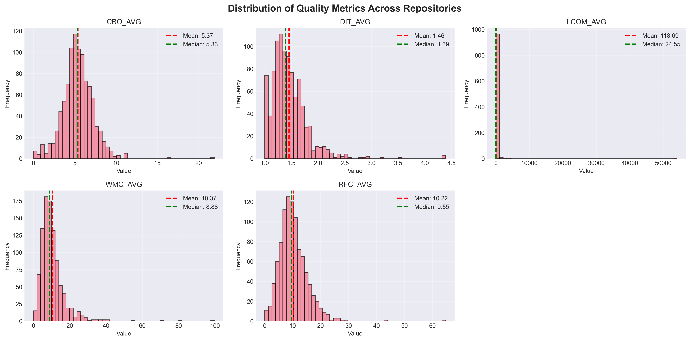
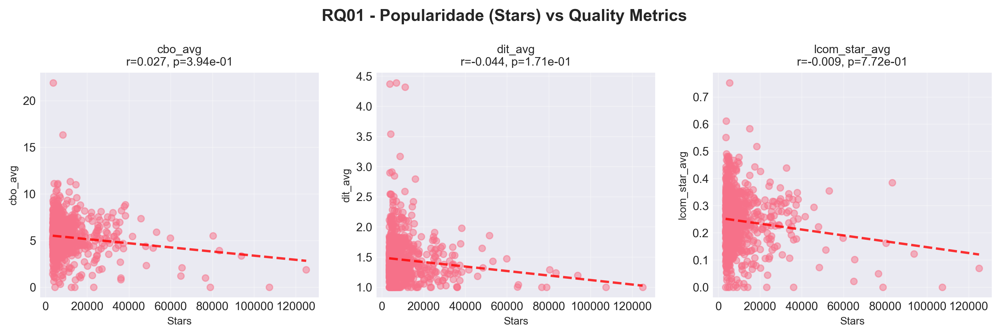
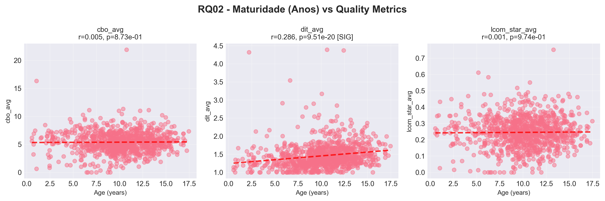
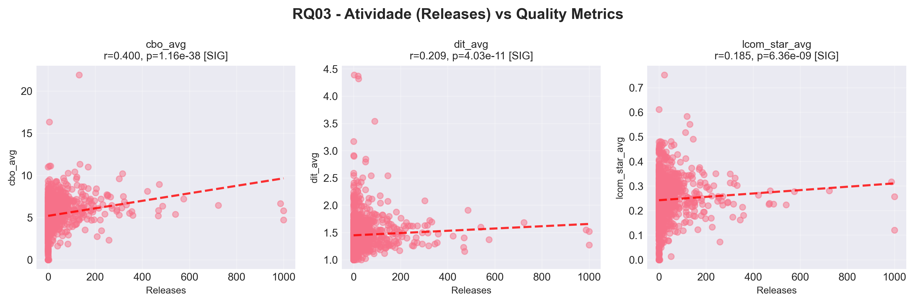
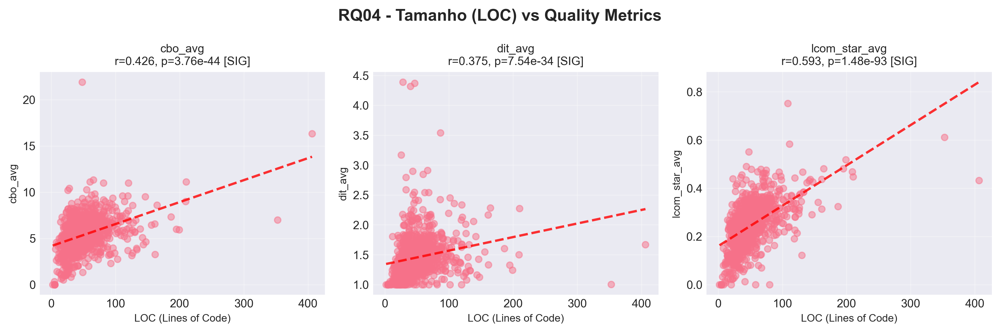
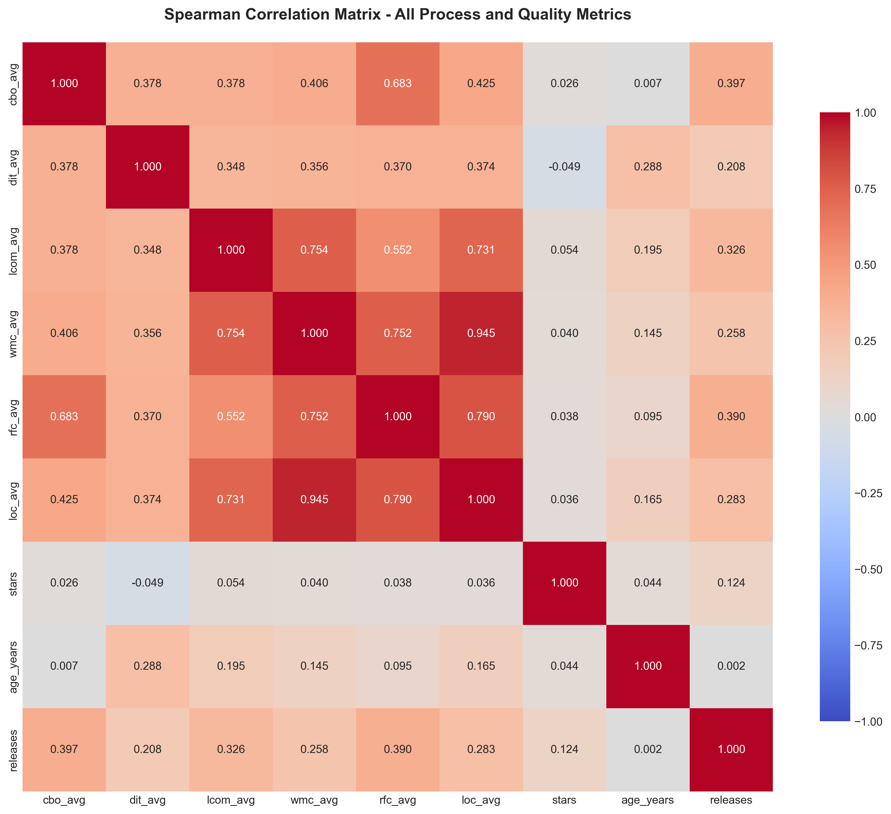

# Um Estudo das Características de Qualidade de Sistemas Java: Correlação entre Métricas de Processo e Produto

**Autor:** Paulo Victor Pimenta Rubinger  
**Data:** 05 de Abril de 2026  
**Versão do Relatório:** 3.0.0  
**Repositório:** [https://github.com/PauloRubinger/LAB-02](https://github.com/PauloRubinger/LAB-02)  
**Disciplina:** Laboratório de Experimentação de Software (6º período — Engenharia de Software)  
**Professor:** João Paulo Carneiro Aramuni

---

## Resumo

Este experimento analisou **974 repositórios Java** da plataforma GitHub para investigar a correlação entre características do processo de desenvolvimento (popularidade, maturidade, atividade e tamanho) e métricas de qualidade de código (CBO, DIT, LCOM*).

**Principais Resultados:**

- **974 repositórios (97,4%)** foram analisados com sucesso dentre os 1.000 coletados.
- **Correlações significativas** encontradas entre tamanho do código e todas as métricas de qualidade.
- **Repositórios maiores** tendem a ter **maior acoplamento e menor coesão**.
- **Atividade (releases)** correlaciona positivamente com piores métricas de qualidade.
- **Popularidade (stars)** não apresenta correlação significativa com qualidade.

---

## 1. Introdução

### 1.1 Contextualização

O desenvolvimento de software open-source caracteriza-se por um ambiente colaborativo onde múltiplos desenvolvedores contribuem em diferentes partes do código. Neste contexto, um dos principais riscos é a degradação dos atributos de qualidade interna do sistema, como:

- **Modularidade** — capacidade de decomposição em partes independentes.
- **Manutenibilidade** — facilidade de realizar mudanças sem introduzir defeitos.
- **Legibilidade** — compreensibilidade do código por outros desenvolvedores.

### 1.2 Problema Foco do Experimento

Como características do processo de desenvolvimento (quantidade de contribuições, idade do projeto, popularidade) se relacionam com a qualidade interna do código? Existe correlação mensurável entre métricas de processo e produto?

### 1.3 Questões de Pesquisa

| ID   | Questão de Pesquisa | Variável Independente | Variável Dependente |
|------|---------------------|----------------------|---------------------|
| RQ01 | Qual a relação entre a **popularidade** dos repositórios e suas características de qualidade? | Estrelas (stars) | CBO, DIT, LCOM* |
| RQ02 | Qual a relação entre a **maturidade** dos repositórios e suas características de qualidade? | Idade (anos) | CBO, DIT, LCOM* |
| RQ03 | Qual a relação entre a **atividade** dos repositórios e suas características de qualidade? | Releases | CBO, DIT, LCOM* |
| RQ04 | Qual a relação entre o **tamanho** dos repositórios e suas características de qualidade? | LOC (Lines of Code) | CBO, DIT, LCOM* |

### 1.4 Hipóteses Informais

- **H1**: Repositórios **mais populares** devem ter **melhor qualidade** (menor CBO, DIT, LCOM*).
- **H2**: Repositórios **mais maduros** (mais antigos) devem ter **melhor qualidade** (refatoração ao longo do tempo).
- **H3**: Repositórios com **mais releases** devem ter **melhor qualidade** (maior atividade = melhor manutenção).
- **H4**: Repositórios **maiores** terão **pior qualidade** (maior LOC correlaciona com maior complexidade).

### 1.5 Objetivo

**Objetivo Principal:** Investigar a correlação entre características do processo de desenvolvimento (popularidade, maturidade, atividade, tamanho) e métricas de qualidade de código (CBO, DIT, LCOM*) em repositórios Java populares.

**Objetivos Específicos:**

1. Coletar dados de 1.000 repositórios Java populares do GitHub.
2. Calcular métricas de qualidade usando a ferramenta CK.
3. Analisar correlações estatísticas entre variáveis independentes e dependentes.
4. Identificar padrões e outliers.
5. Validar hipóteses por meio de testes estatísticos.

---

## 2. Metodologia

### 2.1 Tipo de Estudo

- **Tipo:** Estudo observacional / correlacional
- **Unidade de análise:** Repositório Git
- **Abordagem:** Análise quantitativa com técnicas estatísticas

### 2.2 Fluxo do Experimento

O experimento seguiu um pipeline automatizado de cinco fases, representado no fluxograma a seguir:

```
┌─────────────────────────────────────────┐
│  Fase 1 — Seleção                       │
│  GitHub GraphQL API                     │
│  Top-1.000 repos Java por stars         │
└────────────────────┬────────────────────┘
                     ▼
┌─────────────────────────────────────────┐
│  Fase 2 — Coleta de Metadados           │
│  Stars, Releases, Data de criação, URL  │
└────────────────────┬────────────────────┘
                     ▼
┌─────────────────────────────────────────┐
│  Fase 3 — Análise Estática              │
│  git clone --depth 1                    │
│  CK 0.7.1-SNAPSHOT                      │
│  Extração de CBO, DIT, LCOM*, LOC       │
│                                         │
│  Falha no CK (26 repos)?               │
│    → Registra erro, pula para próximo   │
└────────────────────┬────────────────────┘
                     ▼
┌─────────────────────────────────────────┐
│  Fase 4 — Consolidação                  │
│  Agregação por repositório              │
│  (média, mediana, desvio padrão)        │
│  Limpeza de dados ausentes              │
└────────────────────┬────────────────────┘
                     ▼
┌─────────────────────────────────────────┐
│  Fase 5 — Análise Estatística           │
│  Estatísticas descritivas               │
│  Correlações de Spearman e Pearson      │
│  Geração de gráficos                    │
└─────────────────────────────────────────┘
```

**Descrição das Fases:**

1. **Seleção de Repositórios:** Consulta à GitHub GraphQL API para buscar os 1.000 repositórios Java com mais estrelas, filtrando apenas repositórios com pelo menos um arquivo Java.
2. **Coleta de Metadados:** Para cada repositório, são coletados: `stargazerCount`, `releases.totalCount`, `createdAt` e URL para clone.
3. **Análise Estática com CK:** Clone raso (`--depth 1`) de cada repositório, execução da ferramenta CK para gerar `class.csv` com métricas por classe, e extração de CBO, DIT, LCOM* e LOC.
4. **Consolidação:** Agregação das métricas em nível de repositório (média, mediana, desvio padrão, min, max) e limpeza de dados ausentes ou inconsistentes.
5. **Análise Estatística:** Cálculo de estatísticas descritivas, correlações de Spearman (primária) e Pearson (complementar), e geração de gráficos.

### 2.3 Amostra

| Parâmetro | Valor |
|-----------|-------|
| **Tamanho inicial** | 1.000 repositórios |
| **Analisados com sucesso** | 974 (97,4%) |
| **Excluídos** | 26 (2,6%) — falha na análise CK |
| **Critério de seleção** | Top Java repositories por stars no GitHub |
| **Período** | Snapshot em 09/04/2026 |
| **Inclusão** | Todos os repos com pelo menos 1 arquivo Java |
| **Exclusão** | Repos vazios, forks privados |

### 2.4 Ferramentas e Materiais

| Ferramenta | Versão | Propósito |
|------------|--------|----------|
| Python | 3.14.3 | Orquestração do pipeline e análise estatística |
| GitHub GraphQL API | v4 | Coleta de metadados dos repositórios |
| Git | 2.40.0 | Clone raso dos repositórios |
| CK | 0.7.1-SNAPSHOT | Análise estática de código Java |
| pandas | ≥2.0.0 | Manipulação e consolidação de dados |
| scipy | ≥1.10.0 | Testes estatísticos e correlações |
| matplotlib / seaborn | ≥3.7.0 / ≥0.12.0 | Geração de gráficos e visualizações |

### 2.5 Métricas Utilizadas

#### 2.5.1 Métricas de Processo (Variáveis Independentes)

| Métrica | Unidade | Fórmula | Interpretação |
|---------|---------|---------|----------------|
| Popularidade (Stars) | Contagem | `stargazerCount` | Número de estrelas do repositório |
| Maturidade (Idade) | Anos | `ano_atual − ano_criação` | Quantos anos o repositório existe |
| Atividade (Releases) | Contagem | `releases.totalCount` | Número de releases/versões publicadas |
| Tamanho (LOC) | Linhas | `SUM(loc) / n_classes` | Média de linhas de código por classe |

#### 2.5.2 Métricas de Qualidade (Variáveis Dependentes)

| Métrica | Unidade | Range | Interpretação |
|---------|---------|-------|----------------|
| **CBO** (Coupling Between Objects) | Contagem | 0–∞ | Quantas classes estão acopladas a esta classe. **Menor = Melhor.** |
| **DIT** (Depth Inheritance Tree) | Níveis | 0–∞ | Profundidade da árvore de herança. **Menor = Melhor.** |
| **LCOM*** (Lack of Cohesion of Methods) | Razão normalizada | 0–1 | Falta de coesão entre métodos. **Menor = Melhor.** |

> **Nota:** Utilizamos a versão normalizada LCOM* (0–1), mais confiável que o LCOM original. Para análise em nível de repositório, usamos **média, mediana e desvio padrão** das métricas por classe.

### 2.6 Método Estatístico

1. **Estatísticas Descritivas:** Média, mediana, desvio padrão, min e max para todas as métricas.
2. **Correlação de Spearman (primária):** Adequada para relações monotônicas não necessariamente lineares.
3. **Correlação de Pearson (complementar):** Para avaliar relações lineares.
4. **Correção de Bonferroni:** Para 12 testes (4 RQs × 3 métricas), α corrigido = 0,05 / 12 ≈ 0,0042.
5. **Nível de significância:** p < 0,05 (reportando significância também com Bonferroni).

### 2.7 Tratamento de Dados Ausentes e Exceções

| Situação | Tratamento |
|----------|-----------|
| Clone falha (URL inválida / timeout) | Registra erro no log, pula para o próximo repositório |
| CK falha (código incompatível) | Registra erro no log, pula para o próximo repositório |
| Métrica faltante (CK não gerou `class.csv`) | Marca como incompleto, exclui da análise |
| Repositório duplicado | Deduplica antes do processamento |

**Resultado:** Dos 1.000 repositórios coletados, 26 (2,6%) falharam na análise CK e foram excluídos, resultando em **974 repositórios analisados**.

---

## 3. Resultados

### 3.1 Estatísticas Descritivas

**Métricas de Processo (n = 974):**

| Métrica | Média | Mediana | Desvio Padrão | Min | Max |
|---------|-------|---------|---------------|-----|-----|
| Stars | 9.442,41 | 5.786,50 | 10.714,38 | 3.473 | 125.017 |
| Releases | 41,01 | 11,00 | 89,95 | 0 | 1.000 |
| Idade (anos) | 10,14 | 10,31 | 3,18 | 0,56 | 17,47 |
| LOC_avg | 50,93 | 44,23 | 31,45 | 2,00 | 406,33 |

**Métricas de Qualidade (n = 974):**

| Métrica | Média | Mediana | Desvio Padrão | Min | Max |
|---------|-------|---------|---------------|-----|-----|
| CBO_avg | 5,38 | 5,33 | 1,87 | 0,00 | 21,89 |
| DIT_avg | 1,46 | 1,39 | 0,35 | 1,00 | 4,39 |
| LCOM*_avg | 0,24 | 0,25 | 0,09 | 0,00 | 0,75 |

As métricas de processo apresentam alta variabilidade: a mediana de stars (5.787) é bem inferior à média (9.442), indicando distribuição fortemente assimétrica com poucos repositórios concentrando muitas estrelas. O mesmo se observa em releases, cuja mediana (11) é quatro vezes menor que a média (41). Já as métricas de qualidade possuem menor variabilidade relativa, com médias e medianas próximas — em especial LCOM* (média 0,24 vs. mediana 0,25), sugerindo distribuição simétrica.

### 3.2 Distribuição das Métricas de Qualidade

A Figura 1 apresenta os histogramas de distribuição das três métricas de qualidade analisadas, com linhas indicando média (vermelha) e mediana (verde) de cada distribuição.



**Descrição:** O gráfico apresenta três histogramas lado a lado, cada um mostrando a distribuição de uma métrica de qualidade nos 974 repositórios. CBO_avg (esquerda) exibe distribuição assimétrica à direita; DIT_avg (centro) está fortemente concentrado próximo a 1; LCOM*_avg (direita) distribui-se de forma mais uniforme entre 0 e 0,5.

**Insights:**

- **CBO_avg** apresenta distribuição assimétrica à direita, com a maioria dos repositórios concentrada entre 3 e 7. Poucos repositórios ultrapassam CBO = 10, indicando que a maior parte dos projetos Java populares mantém acoplamento relativamente baixo. O outlier com CBO ≈ 22 sugere um projeto com arquitetura altamente acoplada.
- **DIT_avg** é fortemente concentrada próxima de 1, revelando que a grande maioria dos projetos Java utiliza pouca herança. Valores acima de 2,5 são raros, indicando que hierarquias de herança profundas são exceção entre os projetos populares.
- **LCOM\*_avg** distribui-se de forma relativamente uniforme entre 0 e 0,5, sem concentração extrema em nenhum ponto. A proximidade entre média (0,24) e mediana (0,25) confirma a simetria da distribuição.

### 3.3 RQ01 — Popularidade vs. Qualidade

**Pergunta:** Qual a relação entre a popularidade dos repositórios (stars) e suas métricas de qualidade?

| Correlação | Spearman ρ | p-valor | Significância |
|-----------|------------|---------|---------------|
| Stars vs CBO_avg | 0,0273 | 3,94e-01 | Não significativo |
| Stars vs DIT_avg | −0,0439 | 1,71e-01 | Não significativo |
| Stars vs LCOM*_avg | −0,0093 | 7,72e-01 | Não significativo |

**Hipótese H1:** Repositórios mais populares devem ter melhor qualidade (menor CBO, DIT, LCOM*).

**Resultado:** **H1 rejeitada.** Não foram encontradas correlações estatisticamente significativas entre popularidade (stars) e nenhuma das métricas de qualidade (p > 0,05 em todos os casos).

A Figura 2 apresenta gráficos de Stars vs. as três métricas de qualidade, com linha de tendência e valores de correlação de Spearman.



**Descrição:** Os três gráficos mostram a distribuição de 974 repositórios no espaço Stars × métrica de qualidade. A grande concentração de pontos à esquerda (repositórios com menos de 20.000 stars) e as linhas de tendência praticamente horizontais evidenciam a ausência de relação.

**Insights:**

- A distribuição dos pontos é dominada por repositórios com até 20.000 stars, criando uma nuvem densa à esquerda do gráfico. Repositórios com mais de 40.000 stars são raros e dispersos, sem tendência clara em nenhuma métrica.
- As linhas de tendência são praticamente horizontais, confirmando visualmente que a **popularidade de um repositório no GitHub não é um indicador de qualidade interna do código**. Um projeto pode ser extremamente popular e ter código de qualidade variável.

### 3.4 RQ02 — Maturidade vs. Qualidade

**Pergunta:** Qual a relação entre a maturidade (idade em anos) dos repositórios e suas métricas de qualidade?

| Correlação | Spearman ρ | p-valor | Significância |
|-----------|------------|---------|---------------|
| Idade vs CBO_avg | 0,0051 | 8,73e-01 | Não significativo |
| Idade vs DIT_avg | 0,2857 | 9,56e-20 | Significativo (p < 0,001) |
| Idade vs LCOM*_avg | 0,0010 | 9,75e-01 | Não significativo |

**Hipótese H2:** Repositórios mais maduros devem ter melhor qualidade (refatoração ao longo do tempo).

**Resultado:** **H2 parcialmente rejeitada.** A maturidade não mostrou correlação significativa com CBO (acoplamento) nem com LCOM* (coesão). Porém, repositórios mais antigos apresentam maior DIT (ρ = 0,29, p < 0,001), sugerindo acúmulo de herança ao longo do tempo.

A Figura 3 apresenta gráficos de Idade (anos) vs. as três métricas de qualidade.



**Descrição:** Os gráficos mostram a relação entre a idade do repositório (eixo x, em anos) e cada métrica de qualidade. No painel central (DIT_avg), a linha de tendência ascendente e a marcação "[SIG]" no subtítulo do gráfico indicam a única correlação significativa desta RQ.

**Insights:**

- A correlação com DIT (ρ = 0,29) é a única significativa, indicando que **projetos mais antigos tendem a acumular hierarquias de herança mais profundas** ao longo do tempo — possivelmente por extensões incrementais via subclasses, um padrão comum em projetos Java de longa duração.
- A ausência de correlação com CBO e LCOM* sugere que **acoplamento e coesão são mais influenciados por decisões de design arquitetural** do que pelo tempo de existência do projeto. Projetos antigos não necessariamente degradam nessas dimensões.

### 3.5 RQ03 — Atividade vs. Qualidade

**Pergunta:** Qual a relação entre a atividade (releases) dos repositórios e suas métricas de qualidade?

| Correlação | Spearman ρ | p-valor | Significância |
|-----------|------------|---------|---------------|
| Releases vs CBO_avg | 0,3997 | 1,16e-38 | Significativo (p < 0,001) |
| Releases vs DIT_avg | 0,2095 | 4,03e-11 | Significativo (p < 0,001) |
| Releases vs LCOM*_avg | 0,1847 | 6,36e-09 | Significativo (p < 0,001) |

**Hipótese H3:** Repositórios com mais releases devem ter melhor qualidade (maior atividade = melhor manutenção).

**Resultado:** **H3 rejeitada.** Contrariando a hipótese, todas as correlações são positivas e altamente significativas, indicando que projetos com mais releases apresentam **pior** qualidade interna.

A Figura 4 apresenta gráficos de Releases vs. as três métricas de qualidade.



**Descrição:** Os três gráficos mostram correlações positivas entre o número de releases e cada métrica de qualidade. Os dados estão concentrados à esquerda (maioria dos repositórios tem poucas releases), mas as linhas de tendência ascendentes e as marcações "[SIG]" no subtítulo do gráfico em todos os painéis indicam relações estatisticamente significativas.

**Insights:**

- A correlação mais forte é com CBO (ρ = 0,40), indicando que **projetos mais ativos tendem a ter maior acoplamento entre classes**. Isso pode refletir que projetos com muitas releases crescem em escopo e funcionalidades, adicionando dependências entre módulos.
- As correlações com DIT (ρ = 0,21) e LCOM* (ρ = 0,18) são mais fracas, mas ainda significativas. O padrão geral sugere que a **atividade intensa não implica melhor manutenção** — ao contrário, projetos muito ativos parecem acumular complexidade estrutural com cada nova versão.
- É possível que releases frequentes sejam um indicador para **tamanho e complexidade do projeto**, e não diretamente para qualidade.

### 3.6 RQ04 — Tamanho vs. Qualidade

**Pergunta:** Qual a relação entre o tamanho (LOC médio por classe) dos repositórios e suas métricas de qualidade?

| Correlação | Spearman ρ | p-valor | Significância |
|-----------|------------|---------|---------------|
| LOC_avg vs CBO_avg | 0,4257 | 3,76e-44 | Significativo (p < 0,001) |
| LOC_avg vs DIT_avg | 0,3748 | 7,54e-34 | Significativo (p < 0,001) |
| LOC_avg vs LCOM*_avg | 0,5930 | 1,48e-93 | Significativo (p < 0,001) |

**Hipótese H4:** Repositórios maiores terão pior qualidade (maior LOC correlaciona com maior complexidade).

**Resultado:** **H4 confirmada.** Todas as correlações são positivas e altamente significativas. A correlação mais forte é entre LOC e LCOM* (ρ = 0,59 — moderada a forte), seguida de LOC e CBO (ρ = 0,43 — moderada) e LOC e DIT (ρ = 0,37 — moderada).

A Figura 5 apresenta gráficos de LOC_avg vs. as três métricas de qualidade.



**Descrição:** Os gráficos revelam tendências ascendentes claras em todos os três painéis. O painel direito (LCOM*_avg) apresenta a tendência mais acentuada, com pontos distribuídos ao longo de uma faixa diagonal bem definida. As marcações "[SIG]" confirmam significância em todos os casos.

**Insights:**

- A correlação LOC–LCOM* (ρ = 0,59) é a **mais forte encontrada em todo o estudo**, indicando que classes maiores perdem coesão de maneira consistente. Isso é coerente com o princípio de que classes com muitas linhas tendem a acumular múltiplas responsabilidades.
- A correlação LOC–CBO (ρ = 0,43) mostra que **classes maiores também dependem de mais classes externas**, aumentando o acoplamento. O aumento conjunto de LCOM* e CBO com o tamanho sugere uma violação simultânea dos princípios de Single Responsibility e Low Coupling.
- A correlação LOC–DIT (ρ = 0,37), embora moderada, indica que projetos com classes maiores tendem a utilizar hierarquias de herança mais profundas, possivelmente como forma de reutilização de código.

### 3.7 Visão Geral: Matriz de Correlação

A Figura 6 apresenta a matriz de correlação de Spearman entre todas as métricas analisadas, resumindo visualmente as relações encontradas.



**Descrição:** O heatmap mostra os coeficientes de correlação de Spearman entre todas as combinações de métricas. Cada célula é colorida de acordo com o valor da correlação (escala de cores), e o valor numérico é exibido no centro.

**Insights:**

- O bloco mais intenso está na interseção de LOC_avg com as métricas de qualidade, confirmando que **o tamanho do código é o fator mais associado à qualidade interna**.
- As métricas de qualidade (CBO, DIT, LCOM*) estão **positivamente correlacionadas entre si**, sugerindo que a degradação de qualidade tende a ocorrer simultaneamente em múltiplas dimensões — quando um projeto apresenta alto acoplamento, tende também a ter baixa coesão e herança profunda.
- Stars apresenta correlações muito fracas com todas as demais métricas, reforçando sua **independência em relação à qualidade interna**.

---

## 4. Discussão

### 4.1 Comparação entre Hipóteses e Resultados

| Hipótese | Expectativa | Resultado | Veredito |
|----------|------------|-----------|----------|
| **H1** (Popularidade → Qualidade) | Mais stars = melhor qualidade | Nenhuma correlação significativa | **Rejeitada** |
| **H2** (Maturidade → Qualidade) | Mais antigo = melhor qualidade | Apenas DIT aumenta com idade | **Parcialmente rejeitada** |
| **H3** (Atividade → Qualidade) | Mais releases = melhor qualidade | Mais releases = pior qualidade | **Rejeitada** |
| **H4** (Tamanho → Qualidade) | Maior LOC = pior qualidade | Todas as métricas pioram com LOC | **Confirmada** |

### 4.2 Interpretação dos Resultados

**Popularidade não indica qualidade (RQ01).** O número de estrelas reflete interesse da comunidade, utilidade percebida ou marketing do projeto — não a qualidade interna do código. Um desenvolvedor que busca bibliotecas de alta qualidade não deveria se basear unicamente na contagem de stars.

**Maturidade tem efeito limitado (RQ02).** A única correlação significativa foi entre idade e DIT (ρ = 0,29). Projetos mais antigos acumulam hierarquias de herança mais profundas ao longo do tempo, possivelmente por extensões incrementais via subclasses. A ausência de correlação com CBO e LCOM* sugere que acoplamento e coesão são mais influenciados por decisões de design do que pelo tempo de existência do projeto.

**Atividade correlaciona com complexidade, não com qualidade (RQ03).** Projetos com mais releases tendem a ser maiores e mais complexos, o que explica as correlações positivas com CBO (ρ = 0,40), DIT (ρ = 0,21) e LCOM* (ρ = 0,18). A hipótese de que mais releases implicaria melhor manutenção não se confirmou — provavelmente porque projetos ativos crescem em escopo, aumentando a complexidade estrutural.

**Tamanho é o melhor preditor de qualidade (RQ04).** LOC apresentou as correlações mais fortes e consistentes: LCOM* (ρ = 0,59), CBO (ρ = 0,43) e DIT (ρ = 0,37). Classes maiores tendem a acumular mais responsabilidades (baixa coesão), mais dependências (alto acoplamento) e hierarquias mais profundas. Este resultado reforça o princípio do Single Responsibility e a importância de manter classes pequenas.

### 4.3 Síntese dos Insights

1. **Popularidade não é indicador de qualidade.** A quantidade de estrelas no GitHub não tem relação estatística com as métricas de qualidade interna do código.
2. **Tamanho é o principal preditor de degradação.** LOC apresentou as correlações mais fortes e consistentes com todas as métricas de qualidade (ρ entre 0,37 e 0,59).
3. **LCOM tem distribuição relativamente uniforme.** Média (0,24) e mediana (0,25) próximas indicam simetria.
4. **Atividade e maturidade correlacionam com pior qualidade.** Contrariando as hipóteses iniciais, projetos mais ativos e mais antigos tendem a acumular maior complexidade.
5. **Métricas de qualidade são intercorrelacionadas.** CBO, DIT e LCOM* degradam simultaneamente, indicando que a perda de qualidade é sistêmica.

---

## 5. Ameaças à Validade

### 5.1 Ameaças Internas

- **Vieses de seleção:** Apenas os top-1.000 repositórios Java por stars foram analisados, não representando o universo completo de projetos Java.
- **Fatores de confusão:** Presença de código gerado automaticamente, múltiplas linguagens no mesmo repositório e diferentes paradigmas de projeto podem influenciar os resultados.
- **Falhas de CK:** 2,6% dos repositórios não puderam ser analisados, potencialmente introduzindo viés de seleção.

### 5.2 Ameaças Externas

- **Generalização:** Os resultados valem especificamente para Java em repositórios populares no GitHub. Outras linguagens e plataformas podem apresentar padrões diferentes.
- **Temporalidade:** Trata-se de um snapshot único (abril de 2026), sem análise da evolução temporal.
- **Contexto:** GitHub é uma plataforma específica com características próprias (e.g., stars como métrica social).

### 5.3 Ameaças de Construto

- **Métricas CBO/DIT/LCOM*:** São métricas imperfeitas de qualidade — não capturam todos os aspectos de modularidade e manutenibilidade.
- **LOC:** Métrica bruta, não diferencia código de alta ou baixa qualidade.
- **Releases:** Indica atividade de publicação, não necessariamente manutenção ativa ou qualidade do processo.
- **Causalidade:** Correlações não implicam causalidade — não podemos afirmar que LOC *causa* pior qualidade, apenas que estão associados.

---

## 6. Conclusão

Este estudo analisou 974 dos 1.000 repositórios Java mais populares do GitHub, investigando a relação entre métricas de processo (popularidade, maturidade, atividade e tamanho) e métricas de qualidade de código (CBO, DIT, LCOM*).

**Achados Principais:**

1. **RQ01 — Popularidade vs. Qualidade:** Não há correlação significativa. A popularidade (stars) não prediz a qualidade interna do código.
2. **RQ02 — Maturidade vs. Qualidade:** Repositórios mais antigos apresentam herança mais profunda (DIT, ρ = 0,29), mas sem impacto significativo no acoplamento (CBO) ou coesão (LCOM*).
3. **RQ03 — Atividade vs. Qualidade:** Projetos com mais releases têm pior qualidade em todas as métricas (CBO ρ = 0,40; DIT ρ = 0,21; LCOM* ρ = 0,18), sugerindo crescimento de complexidade com a atividade.
4. **RQ04 — Tamanho vs. Qualidade:** O tamanho do código (LOC) é o preditor mais forte de degradação da qualidade, com correlação moderada-forte com LCOM* (ρ = 0,59) e moderada com CBO (ρ = 0,43) e DIT (ρ = 0,37).

**Conclusão geral:** O tamanho das classes é o fator dominante na qualidade do código Java. Projetos devem priorizar classes menores e mais coesas para manter bons indicadores de qualidade interna, independentemente da popularidade ou idade do repositório.

**Recomendações para pesquisa futura:**

1. Estender a análise a outras linguagens de programação.
2. Coletar dados longitudinais (acompanhar os mesmos repositórios ao longo do tempo).
3. Incluir análise qualitativa (entrevistas com mantenedores).
4. Investigar práticas específicas que melhoram qualidade (e.g., code review, CI/CD).
5. Correlacionar métricas de código com defeitos reportados (issues).

---

## 7. Reprodutibilidade

### 7.1 Como Repetir o Experimento

```bash
# 1. Clone o repositório
git clone https://github.com/PauloRubinger/LAB-02.git
cd LAB-02

# 2. Crie ambiente virtual e instale dependências
python -m venv .venv
.venv\Scripts\Activate.ps1    # Windows
source .venv/bin/activate      # Linux/Mac
pip install -r requirements.txt

# 3. Execute o pipeline de coleta e análise estática
python src/main.py

# 4. Gere análise estatística e gráficos
python src/analysis/correlations.py
```

### 7.2 Dados e Código

| Artefato | Localização |
|----------|-------------|
| Repositório | [https://github.com/PauloRubinger/LAB-02](https://github.com/PauloRubinger/LAB-02) |
| Dados brutos (metadados) | `data/raw/repositories.csv` |
| Dados processados (métricas) | `data/processed/consolidated_metrics.csv` |
| Estatísticas descritivas | `reports/descriptive_stats.json` |
| Correlações detalhadas | `reports/correlations_detailed.json` |
| Código-fonte | `src/` |
| Logs de execução | `logs/processing_*.json` |

---

## Referências

1. **CK — Code Metrics:** Aniche, M. *CK: A tool to compute class-level code metrics for Java projects.* Disponível em: [https://github.com/mauricioaniche/ck](https://github.com/mauricioaniche/ck)

2. **GitHub GraphQL API v4.** Disponível em: [https://docs.github.com/en/graphql](https://docs.github.com/en/graphql)

---

## Apêndices

### Apêndice A — Configurações e Parâmetros

```python
# GitHub GraphQL Query
query: "language:Java sort:stars"
max_results: 1000
fetch_per_page: 10

# Git Clone
depth: 1  # Shallow clone para economizar armazenamento em disco
timeout: 600s por repositório

# Processamento
batch_size: 1 repo por vez  # Para economizar armazenamento em disco
```

### Apêndice B — Logs de Execução

**Resumo da execução:**

| Etapa | Resultado |
|-------|----------|
| Total de repositórios tentados | 1.000 |
| Clone bem-sucedido | 1.000 (100%) |
| Análise CK bem-sucedida | 974 (97,4%) |
| Análise CK falhou | 26 (2,6%) |

**Matriz de falhas:**

| Tipo de Falha | Contagem | Repositórios Afetados |
|---------------|----------|---------------------|
| CK NullPointerException | 12 | elastic_elasticsearch, NationalSecurityAgency_ghidra, dbeaver_dbeaver, oracle_graal, thingsboard_thingsboard, questdb_questdb, Grasscutters_Grasscutter, neo4j_neo4j, projectlombok_lombok, trinodb_trino, haifengl_smile, JabRef_jabref |
| CK IOException | 3 | JetBrains_intellij-community, checkstyle_checkstyle, dragonwell-project_dragonwell8 |
| CK Runtime Warning/Error | 1 | openjdk_jdk |
| CK ArrayIndexOutOfBoundsException | 1 | google_j2objc |
| Metrics Extraction Empty | 9 | Snailclimb_JavaGuide, hollischuang_toBeTopJavaer, frank-lam_fullstack-tutorial, react-native-camera_react-native-camera, CoderLeixiaoshuai_java-eight-part, Archmage83_tvapk, RedSpider1_concurrent, jlegewie_zotfile, NotFound9_interviewGuide |

### Apêndice C — Ambiente de Execução

| Componente | Versão |
|------------|--------|
| Sistema Operacional | Windows 11 / macOS |
| Python | 3.14.3 |
| Java | 21.0.3 |
| Git | 2.40.0 |
| CK | 0.7.1-SNAPSHOT |

**Dependências Python:**

```
certifi==2026.2.25
charset-normalizer==3.4.6
idna==3.11
python-dotenv==1.2.2
requests==2.33.0
urllib3==2.6.3
pandas>=2.0.0
numpy>=1.24.0
scipy>=1.10.0
matplotlib>=3.7.0
seaborn>=0.12.0
```

---

**Versão:** 3.0.0 | **Data:** 10/04/2026 | **Status:** Revisado
